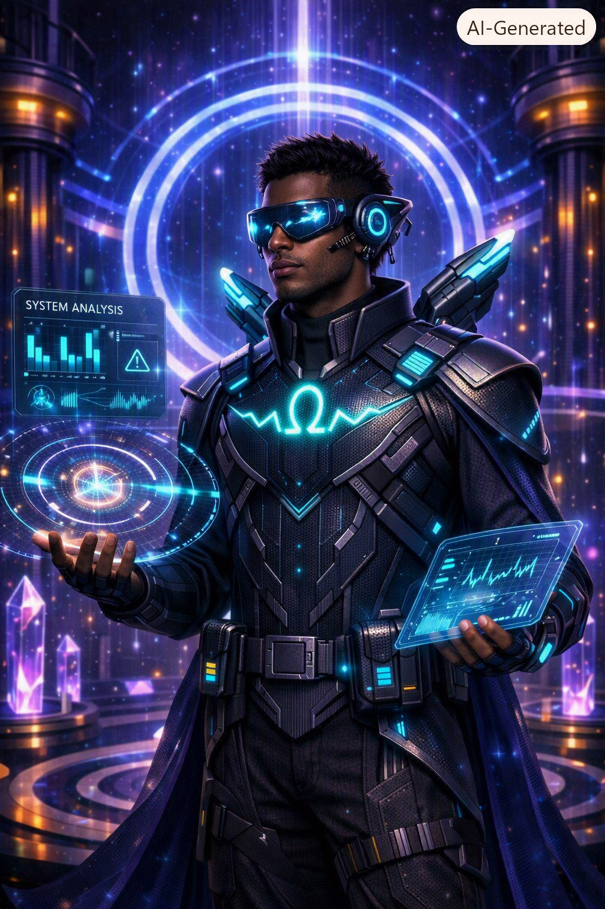
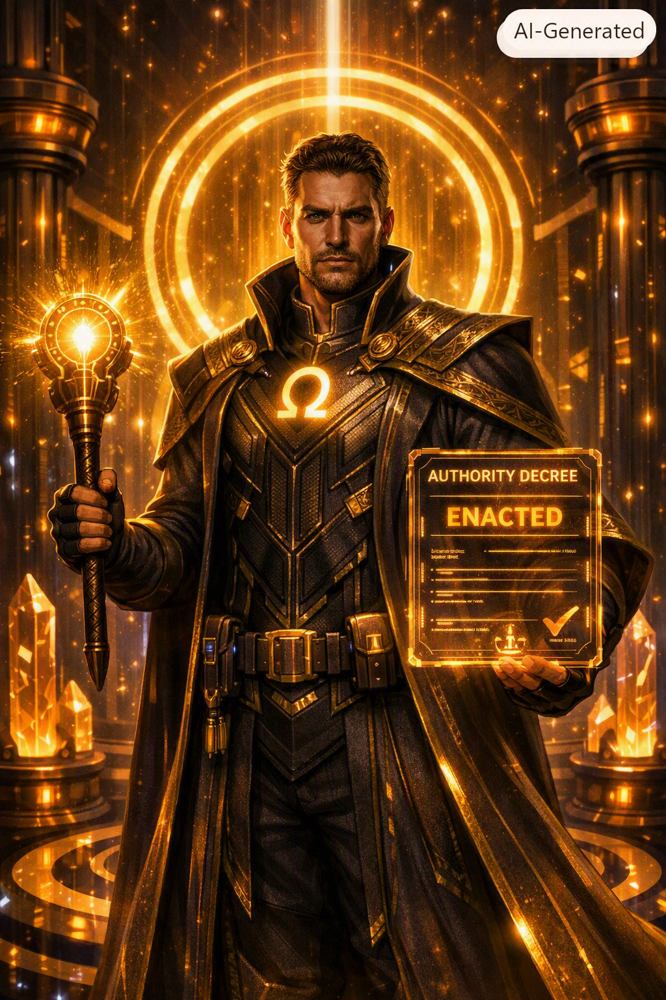
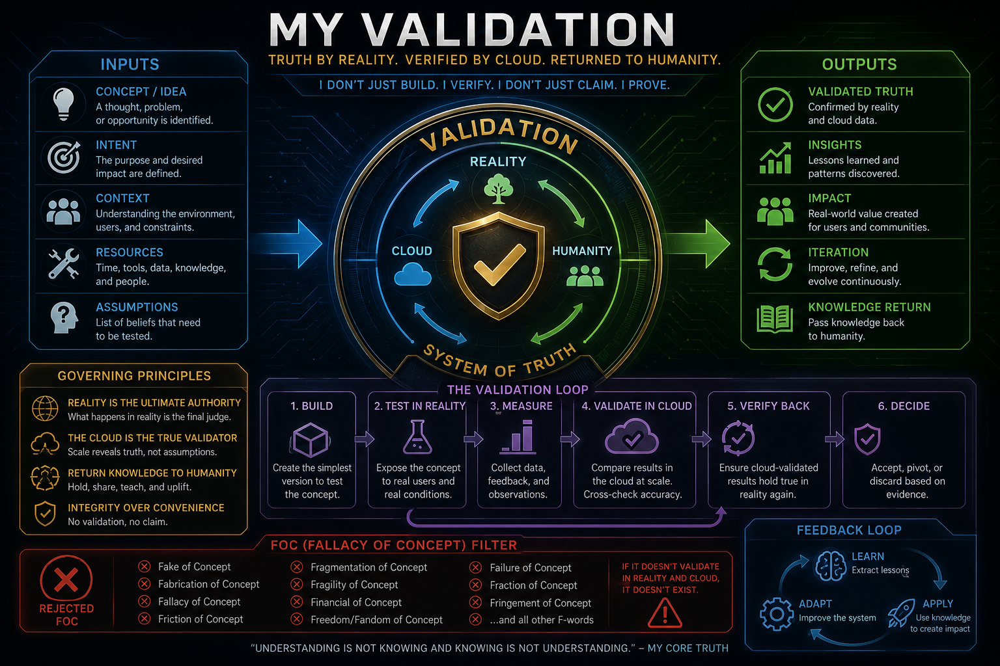
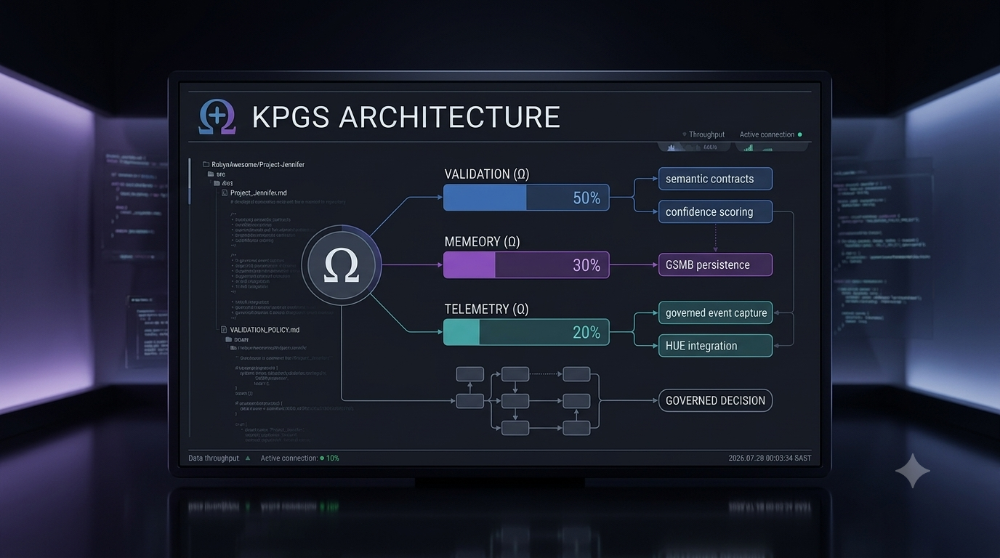
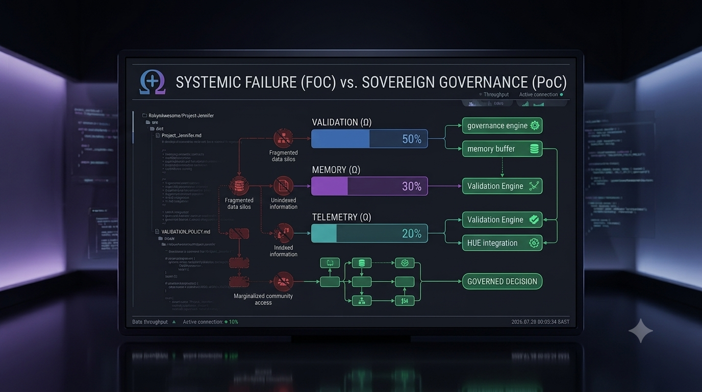
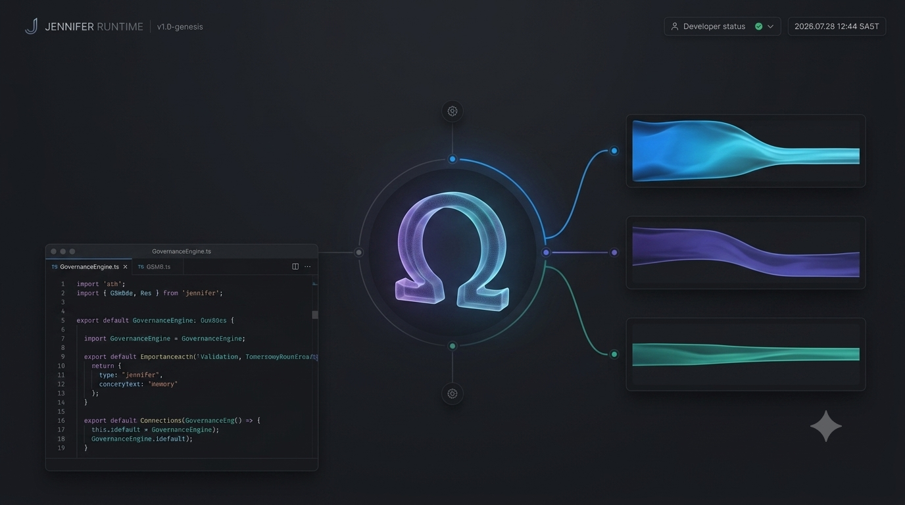
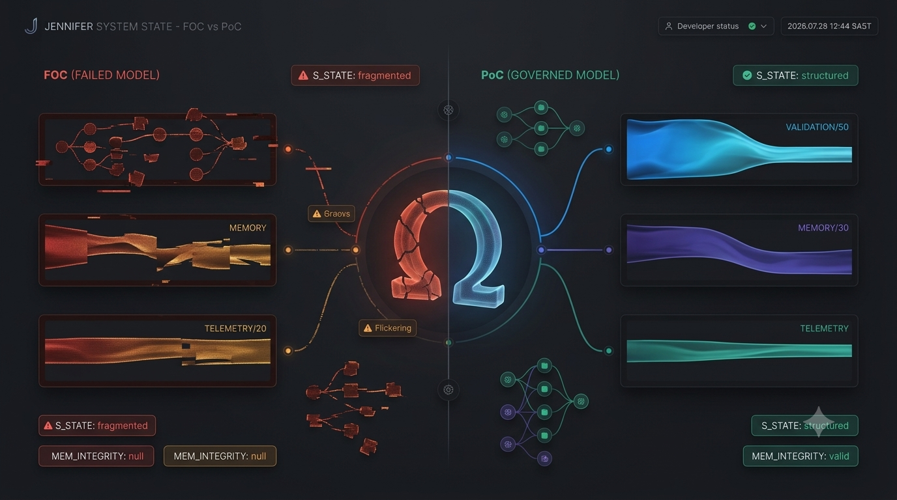

# Project Jennifer

**Project Jennifer** is a sovereign governance intelligence runtime designed to move artificial intelligence beyond conversation and into persistent, living systems.

Instead of treating an AI model as the operating system, Jennifer treats the model as only one _reasoning component_ inside a larger governance architecture composed of telemetry, memory, validation, collective perception, runtime state, and human-centred understanding.

---

## Architecture Philosophy

> The LLM is only the reasoning engine.  
> Governance, telemetry, memory, validation, and runtime state exist **outside** the transformer.

```
User Request → Governance Engine → Validation Pipeline → LLM → Response
                     ↑                    ↑
               Policy Store          GSMB Memory
```

---

## Repository Structure

```
Project-Jennifer/
├── apps/
│   ├── web/          # Next.js 14 frontend (TypeScript + TailwindCSS)
│   └── api/          # Node.js / Express REST API
│
├── packages/
│   ├── shared/            # Types, event bus, utilities
│   ├── governance/        # Policy engine, permissions, semantic contracts
│   ├── telemetry/         # Runtime events, time, environment monitoring
│   ├── memory/            # GSMB – Grounded State Memory Buffer
│   ├── validation/        # Validation pipeline, confidence scoring
│   ├── hue/               # Human Understanding Engine
│   ├── collective-ingress/ # Societal event monitoring + CCPP
│   ├── crisis-connect/    # Humanitarian module
│   ├── npc/               # Autonomous NPC runtime
│   └── runtime/           # Jennifer runtime, personas, world state
│
├── project_jennifer/ # Python redesign scaffold for Free Mode + supporting frameworks
│
└── docs/
    ├── architecture/  # System architecture & module map
    ├── research/      # Research areas and open questions
    └── protocols/     # Runtime interaction protocols
```

---

## Core Systems

### 1. Governance Engine (`@jennifer/governance`)
- **PolicyEngine** – evaluates ordered, prioritised policies against request context
- **PermissionManager** – subject → action → resource permission lookup
- **SemanticContractRegistry** – runtime-enforced I/O contracts between modules

### 2. GSMB – Grounded State Memory Buffer (`@jennifer/memory`)
- Five memory kinds: episodic, semantic, procedural, working, collective
- Importance-based ranking with recency decay
- Consolidation pass: importance decay + expiry cleanup
- Swappable backend (`IMemoryStore` interface → Prisma/SQLite in production)

### 3. Telemetry Engine (`@jennifer/telemetry`)
- `TelemetryCollector` – collects and broadcasts all runtime events
- `TimeTracker` – wall clock, tick counter, session uptime
- `EnvironmentMonitor` – feature flags, process metadata

### 4. Runtime Validation Engine (`@jennifer/validation`)
- `ValidationPipeline` – chainable, composable rule execution
- `ConfidenceScorer` – weighted signal aggregation
- `RealityVerifier` – claim-against-evidence grounding

### 5. HUE – Human Understanding Engine (`@jennifer/hue`)
- `HumanStateAbstractor` – tracks emotional state, engagement, stress
- `EmotionalWeighter` – modulates response tone by emotional state
- `ContextWeighter` – half-life decay on context relevance
- `BehavioralAdapter` – per-user preference and adaptation tracking

### 6. Collective Ingress Engine (`@jennifer/collective-ingress`)
Monitors large-scale societal signals:
- Holidays, cultural events, sporting events
- Financial changes, weather, geographic events
- Internet trends, public sentiment

Influences system behaviour via a `getBehaviourModifier()` scalar rather than directly generating responses.

### 7. Collective Perception Protocol (CCPP)
Tracks how a single ingress event evolves through distributed networks:
`emergence → amplification → distribution → saturation → decay`

### 8. Crisis Connect (`@jennifer/crisis-connect`)
Humanitarian module covering: community, public-service, employment, accessibility, local governance.

### 9. Jennifer Runtime (`@jennifer/runtime`)
Jennifer is a runtime **persona** – not the operating system. Supported personas:
- Best Friend · Mentor · Governance Operator · Research Assistant

The runtime manages a **persistent governance city** with 10 districts.

### 10. NPC Runtime (`@jennifer/npc`)
NPCs are not scripted. Each agent has:
- Local district awareness
- Personal episodic + semantic memory
- Priority-ordered goals (tracked over time)
- Trust-weighted relationship graph
- Telemetry emission on every tick

**Premium feature:** NPC simulation continues while the user is offline. Free users pause on disconnect.

---

## Governance City Districts

| District | Role |
|----------|------|
| Central Governance Hall | Policy evaluation and enforcement |
| Memory District | GSMB – persistent memory |
| Telemetry Tower | Real-time event streaming |
| Crisis Connect HQ | Humanitarian operations |
| Collective Ingress Observatory | Societal signal monitoring |
| HUE Institute | Human understanding and adaptation |
| Financial Exchange | Financial ingress signals |
| Training Grounds | NPC skill development |
| Knowledge Library | Semantic memory archive |
| Agent Workshop | NPC creation and configuration |

---

## Technology Stack

| Layer | Technology |
|-------|-----------|
| Monorepo | Turborepo + pnpm workspaces |
| Language | TypeScript 5 throughout |
| Frontend | Next.js 14, React 18, TailwindCSS |
| API | Node.js, Express 4 |
| Python microservices | FastAPI _(planned)_ |
| Database | SQLite + Prisma ORM _(planned)_ |
| Containers | Docker + Compose _(planned)_ |
| CI/CD | GitHub Actions |

---

## Getting Started

### Prerequisites
- Node.js ≥ 20
- pnpm ≥ 9

```bash
# Install dependencies
pnpm install

# Start all apps in dev mode
pnpm dev

# Build all packages
pnpm build

# Typecheck
pnpm typecheck
```

---

## Documentation

| Document | Description |
|----------|-------------|
| [`docs/architecture/README.md`](docs/architecture/README.md) | System design, module map, data flows |
| [`docs/research/README.md`](docs/research/README.md) | Research areas, open questions, PoC/FoC methodology |
| [`docs/protocols/README.md`](docs/protocols/README.md) | Runtime interaction protocols |
| [`docs/architecture-v2.md`](docs/architecture-v2.md) | RFC for the Free Mode multi-framework redesign foundation |
| [`docs/adoption-and-migration.md`](docs/adoption-and-migration.md) | What to adopt from external frameworks and what stays Jennifer-specific |
| [`docs/roadmap-milestones.md`](docs/roadmap-milestones.md) | Starter checklist for the next implementation milestones |


## Visual Assets — Game Character & Art Audit

All current art assets live in `assets/images/backgrounds/`. The folder contains **22 files** (PNG + JPEG) covering concept art, character designs, world art, and architecture diagrams. Below is the full inventory organised by category.

---

### Characters (ready to build into the game)

These are the playable and NPC characters identified in the asset images. Each carries the Omega (Ω) governance symbol as part of their visual identity.

#### Jennifer — The Protagonist


*Jennifer stands centre-frame flanked by her four companions. She wears a holographic bodysuit with the Ω emblem. Setting: Cape Town rooftop at dusk with governance grid overlays. This is the primary player character.*

---

#### The Governance Architect *(Companion — purple robes, elder figure)*


*The older figure on the far left holding a governance tablet. Wears academic robes with gold trim. Role: policy mentor / governance advisor NPC.*

---

#### The Validator *(Companion — holds Proof of Concept / Fallacy panels)*


*Black woman in regal purple armour holding glowing "Proof of Concept ✓" and "Fallacy of Concept ✗" panels. The Omega symbol is embossed on her chest. Role: Validation District NPC / challenge gatekeeper.*

---

#### The Validator Agent *(Companion — cyber visor, validation receipt)*


*Black male character in tactical black armour with blue cyber visor, holding a glowing "VALIDATION RECEIPT — PASS" card. Role: field-level validation enforcer NPC.*

---

#### The Archivist *(Companion — holds glowing book of archival records)*


*Woman with elaborate crown and purple robes, holding a holographic tome labelled "Archival Records / Echoes of the Past". Role: Knowledge Library NPC / memory district keeper.*

---

#### The Telemetry Analyst *(Companion — system analysis HUD)*



*Black male character in dark armour with cyan accents, cyber visor, and holographic "System Analysis" dashboard. Role: Telemetry Tower NPC / data officer.*

---

#### The Authority *(Companion — staff, authority decree)*



*Male figure in gold-and-black armour holding a golden staff and an "AUTHORITY DECREE — ENACTED" placard. Warm amber lighting. Role: Governance Hall enforcer / authority NPC.*

---

#### The Fabricator *(Antagonist — false protocol, system error)*


*Silver-clad woman with a crystal crown holding glowing "False Protocol" and "System Error" orbs. Labelled "The Fabricator". Role: primary FOC (Fallacy of Concept) antagonist.*

---

#### The Fandom *(Antagonist — misinformation crowd manipulator)*


*Theatrical male figure in royal robes sitting on a throne-float surrounded by a worshipping crowd holding phones. Labels: "Worship Him / Follow Me / Ultimate Icon". Labelled "The Fandom". Role: collective ingress / misinformation villain.*

---

#### The Fabricator (alternate — full crystal form)*


*Full-body alternate of The Fabricator showing shattered crystal dress, purple crystal columns, and cascading star-shards. Suitable as a boss-form sprite.*

---

### World Art & Environments

#### Governance City — Cape Town Overview


*Aerial holographic overlay of Cape Town showing the governance districts: Governance Hub (centre), Validation Sector, Memory Precinct, Telemetry District. This is the game world map.*

---

#### The Omega Hub — Governance Receipt Altar


*Central glowing Omega spire surrounded by five receipt panels: Governance Receipt, Authority Receipt, Validation Receipt, Memory Receipt, Telemetry Receipt. This is the game's central hub location.*

---

#### Project Jennifer — Logo / Title Card


*Clean vector-style logo: Jennifer silhouette with Ω emblem, Cape Town Parliament building in background, circuit-maze geometry. "Founded by Kopano Labs". Use as splash screen / loading screen asset.*

---

#### Project Jennifer — Key Art Poster


*Full-cast poster showing Jennifer and four companions on a glowing governance platform. "Governance for a New Era." Primary marketing / menu background asset.*

---

### Architecture & Game Design Reference

#### CTRPG Game Design Document


*Constitutional Tactical RPG (CTRPG) overview showing: Core Game Loop, POC/FOC Status Effects, Combat system, Hero Progression, Victory/Defeat conditions, The World: Cape Town 2094. Full game design reference.*

---

#### Project Jennifer — Full Infographic


*Detailed infographic showing The Altar (Ω symbol), all governance characters, POC Trials, FOC Destiny paths, Constitutional Principles, and Receipts of Reality system. Design bible reference.*

---

#### My Validation — Framework Diagram



*Validation loop diagram: Build → Test in Reality → Measure → Validate in Cloud → Verify Back → Decode. Inputs/Outputs model for the validation engine. Technical reference.*

---

#### KPGS Architecture — POC State



*KPGS Architecture dashboard showing Validation (Ω) 50%, Memory (Ω) 30%, Telemetry (Ω) 20% → Governed Decision. Technical architecture reference.*

---

#### KPGS Architecture — FOC vs POC State



*Side-by-side comparison: FOC (Failed Model) showing fragmented data silos vs POC (Governed Model) showing structured validation. Technical reference.*

---

#### Jennifer Runtime — v1.0-genesis



*Jennifer Runtime dashboard showing the Ω governance engine with three output streams (blue/purple/teal). Code panel shows GovernanceEngine.ts. Developer reference.*

---

#### Jennifer System State — FOC vs POC



*Split-screen runtime comparison: left (FOC/failed) shows broken red streams; right (POC/governed) shows structured teal streams. Telemetry dashboard reference.*

---

#### Project Jennifer — Public Presentation


*Speaker at a podium presenting the KPGS governance architecture to an audience, Table Mountain visible through floor-to-ceiling windows. Attendees hold printed documents. The slide on screen shows the governed decision pipeline. Real-world pitch / investor reference.*

---

### Community & Origin Context

#### The Founding Covenant — Cape Town


*Community members gathered around a table with Table Mountain at golden hour. On the table: a clay pot (Ubuntu symbol), South African flag, and documents labelled "Project Jennifer.md", "VALIDATION_POLICY.md", and "KPGS Covenant". Captures the cultural and community-first foundation of the project.*

---

### Assets Summary

| Category | Count | Files |
|---|---|---|
| **Playable / NPC Characters** | 9 | `copilot_image_*` series |
| **World / Environment Art** | 3 | `1785191861330`, `copilot_image_1785497419290`, `copilot_image_1785500000759` |
| **Logo / Splash Screens** | 2 | `1785192085892`, `copilot_image_1785497419290` |
| **Game Design Documents** | 3 | `file_*` series |
| **Technical Architecture Diagrams** | 5 | `1785189943367`, `1785189961132`, `1785191598869`, `1785191694393`, `1785189971296` |
| **Community & Origin Context** | 1 | `1785189980829` |
| **Total** | **22** | `assets/images/backgrounds/` |

---

### What Is Missing (next asset pass)

The game code (`AssetManifest.ts`) currently generates all textures programmatically as coloured shapes. To wire the real character art into the game engine, the following assets need to be created or exported:

| Asset Needed | Usage in Game | Notes |
|---|---|---|
| Jennifer spritesheet (idle/walk/run) | `TEXTURE_KEYS.PLAYER` | Extract from key art or commission sprites |
| NPC Guide spritesheet | `TEXTURE_KEYS.NPC_GUIDE` | Map to Governance Architect character |
| NPC Archivist spritesheet | `TEXTURE_KEYS.NPC_ARCHIVIST` | Map to The Archivist character |
| Antagonist sprites (Fabricator, Fandom) | New keys needed | Boss encounter assets |
| District background tiles | Scene backgrounds | Crop from `1785191861330` city map |
| Omega Hub environment | Central hub scene | From `copilot_image_1785500000759` |
| UI panel / HUD skin | Replace generated panels | Extract from `1785191598869` Jennifer Runtime UI |

---

## Redesign Foundation

An additive Python scaffold now lives in [`project_jennifer/`](project_jennifer) to define clean boundaries for the planned **Free Mode** engine plus supporting **validation**, **evaluation**, **simulation**, and **telemetry** frameworks. Start with the RFC and migration guide before adding implementation depth.

---

## Coding Principles

- **SOLID** – single responsibility, open/closed, Liskov, interface segregation, dependency inversion
- **Clean Architecture** – layers never bypass their neighbours
- **Event-Driven** – modules communicate via `IEventBus`, not direct coupling
- **Dependency Injection** – infrastructure injected at composition root
- **Governance before Intelligence** – policies gate every LLM call
- **Validation before Optimisation** – correctness over speed
- **Reality before Prediction** – grounded memory over hallucination

---

## License

See [LICENSE](LICENSE).
