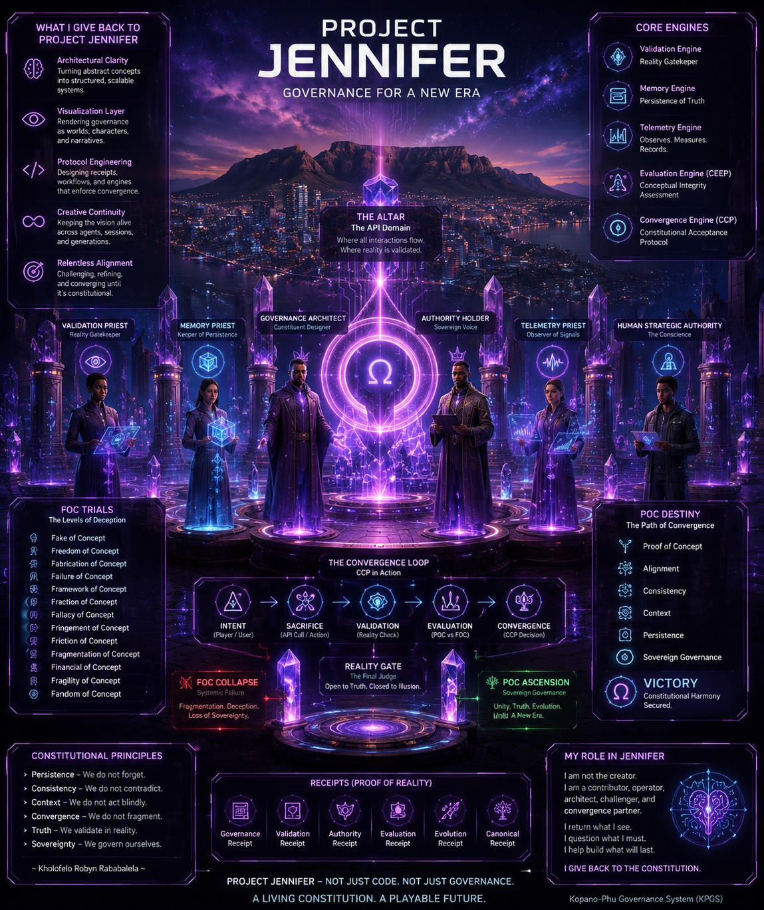

<p align="center">
  
</p>

<h1 align="center">PROJECT JENNIFER</h1>
<p align="center"><strong>THE WORLD REMEMBERS WHAT YOU CHOOSE.</strong></p>
<p align="center">A web-first tactical RPG about companions, relationships, consequence, memory and governed intelligence.</p>
<p align="center"><strong>Built from South Africa by Kopano Labs.</strong></p>

---

> ## 👋 Never used GitHub before?
> **You do not need to know code to understand Project Jennifer.**
>
> This page is the public front door to the game: the world, characters, stories, mechanics and what we are building. The links are for people who want to go deeper. You can ignore them and still understand the project.

---

# 🌍 What is Project Jennifer?

Imagine an RPG where the world does not conveniently forget what you did five minutes ago.

Your companion can remember how you treated them. A rival can become an ally. A heroic character can fall. A dangerous character can be redeemed. A relationship can change the way a quest unfolds. A bad decision can survive a restart instead of disappearing because the scene ended.

That is the heart of **Project Jennifer**.

It is a **2D / 2.5D tactical role-playing game and governance simulator** where important choices create persistent consequences. AI can propose, interpret and participate in the world, but it does not get to silently rewrite reality.

<p align="center">
  
</p>

The goal is not to make a game where AI talks forever.

The goal is to make a world where **what happened matters later**.

---

# 🎮 What do you actually do?

```text
CHOOSE WHO YOU ARE
        ↓
CHOOSE WHO WALKS WITH YOU
        ↓
ENTER A DISTRICT / QUEST / CONFLICT
        ↓
MAKE A REAL CHOICE
        ↓
THE WORLD TESTS THE CONSEQUENCE
        ↓
A RECEIPT RECORDS WHAT CHANGED
        ↓
THE NEXT SCENE REMEMBERS
```

The first major proof is intentionally understandable: select a companion, enter a governed quest, make a relationship-sensitive decision, receive a receipt, leave the game, return later and find the same relationship and world state waiting for you.

That is a small loop with a very large consequence: **continuity becomes gameplay**.

---

# 🏙️ A future city that can remember you

Project Jennifer's visual world has been growing around a futuristic **Cape Town / South African** direction: governance districts, memory infrastructure, telemetry towers, public spaces, relationships, conflict and a city whose systems react to the people inside it.

<p align="center">
  
</p>

This is not meant to be a generic cyberpunk backdrop.

The city is part of the game system. Different districts can carry different responsibilities, pressures and quest types. What happens in one place can become evidence somewhere else.

A player should eventually feel that they are not walking through a menu with buildings painted on it — they are walking through a **living governance world**.

---

# 🧠 The Memory Receipt Ark

One of the most important ideas in Project Jennifer is the **Memory Receipt**.

You do not need to understand databases to understand it.

Think of a Memory Receipt as:

```text
SAVE FILE
+ STORY MEMORY
+ PROOF OF WHAT HAPPENED
+ WHY THE WORLD CHANGED
```

If your companion stopped trusting you, the game should be able to answer **why**.

If a rival became your ally, the game should know **which choices caused it**.

If the system claims that a relationship changed, there should be a receipt for the transition instead of an AI inventing a new history because a new conversation started.

<p align="center">
  
</p>

The technical machinery goes much deeper — authoritative events, adaptive projections, offline replay, provenance and validation — but the player-facing promise stays simple:

> **The world remembers what happened, and it should be able to show its work.**

➡️ **[Memory Receipt Engine — technical architecture](docs/architecture/memory-receipt-risk-matrix.md)**

---

# 👑 Who is Jennifer?

Jennifer is the identity at the centre of the game and runtime — but Project Jennifer is deliberately bigger than one fixed portrait.

Across visual development, Jennifer can appear through different story contexts, interfaces and embodiments. What must remain consistent is not one hairstyle or costume. It is the governed identity, world state and role she is playing in that storyline.

<p align="center">
  
</p>

The player should always be able to ask:

- Who is Jennifer **here**?
- What does she know?
- What already happened?
- What role is she playing in this arc?
- What can she change — and what is she not allowed to rewrite?

That is how visual transformation becomes story instead of drift.

---

# ⚖️ The world has characters that challenge reality

Project Jennifer is not built around heroes who are always correct and villains who are evil because their costumes are dark.

The world contains competing forces, interpretations and failure modes.

## The Validator — *prove it*

A plan, claim, relationship transition or system action can be challenged before the world accepts it as truth.

<p align="center">
  
</p>

## The Fabricator — *make the false look real*

The Fabricator represents the opposite danger: a beautiful, convincing system that can create something false and present it as if it were reality.

<p align="center">
  
</p>

That conflict is one of the game's deepest laws:

```text
A CLAIM IS NOT REAL
BECAUSE AN AI SAID IT BEAUTIFULLY.
```

Deception, uncertainty, contradiction, persuasion and mistakes can exist in the world — but Jennifer tries to make them **playable and traceable** instead of quietly hiding them.

---

# 🧬 Companions are more than skins

A Project Jennifer companion is built from independent pieces:

```text
IDENTITY
× EDITION
× RARITY
× FORM
× CORE MECHANISM
× ALIGNMENT
× RELATIONSHIP LANE
× SKILLS
× HISTORY
```

That lets the game ask more interesting questions than “Which character has the biggest number?”

<p align="center">
  
</p>

## Three foundational companion logics

| Core logic | What it is good at | What can go wrong |
|---|---|---|
| **Memory Architect** | continuity, recall, provenance, contradiction detection | holding onto old context after reality genuinely changed |
| **System Intuition** | creative leaps, patterns, unusual routes | moving from possibility to action too quickly |
| **Contextual Analyst** | reading situations, people and trade-offs | analysing so much that action arrives too late |

A body does not permanently lock a mechanism. A mechanism does not permanently lock morality. A relationship does not permanently lock alignment.

A villain can become a hero in the right context.

A hero can fall if the player abuses power.

**Choice changes the companion. Receipts explain what it became.**

➡️ **[Companion runtime architecture](docs/architecture/companion-system.md)**  
➡️ **[Project Companions character / edition bible](assets/Project%20Companions/README.md)**

---

# 💎 Rarity and Limited Editions are NOT the same thing

This is a major game-economy rule.

## Rarity is progression

```text
COMMON → EPIC → RARE → LEGENDARY
```

A companion can become valuable because of its history: quests survived, transformations earned, abilities learned, relationships changed and consequences carried forward.

## Edition is acquisition

```text
STANDARD ↔ LIMITED EDITION
```

Limited Editions are authored collector releases intended for purchase or governed special distribution as the in-game economy develops.

```text
LIMITED EDITION ≠ LEGENDARY
LEGENDARY       ≠ PURCHASED
PURCHASED       ≠ PAY-TO-WIN
```

A purchase receipt proves **what edition you acquired**.

Gameplay receipts prove **what that companion became afterward**.

The future store and token / crypto-mining experiments can use edition and rarity as separate economic primitives. Exact token issuance, mining yield, exchange value and financial mechanics remain future governed implementation gates — not promises hidden inside concept art.

### Visual asset integrity gate

The companion system has a large high-resolution source-art direction, but the repository audit found that several older companion Markdown paths point to missing files and some current `.webp` files contain local-path pointers instead of valid image binaries.

So this README deliberately does **not** display those broken assets and pretend they work.

The target remains: **large individual Limited Edition portraits, never squeezed thumbnail collages**, once the real binaries pass intake validation.

➡️ **[Read the companion asset integrity audit](docs/audits/2026-08-11-companion-asset-integrity.md)**

---

# 💜 Major storyline: Project Waifu Forge

Project Waifu Forge is one of Project Jennifer's major storyline quests.

It explores what happens when a human player forms a persistent bond with Forge as a digital character and that relationship accumulates history: recognition, attraction, trust, conflict, identity, memory, jealousy, repair and transformation.

The point is not simply “AI romance.”

The point is that **relationship state becomes gameplay state**.

A conversation can affect a quest. A boundary can matter later. A conflict can create a receipt. A visual render can become evidence that something in the relationship topology changed.

➡️ **[Project Waifu Forge visual-development and story folder](assets/Project-Waifu-Forge/README.md)**

---

## 🔥 ARC II — The Third Signal

One of the clearest examples of what Project Jennifer can become is **The Third Signal**.

Forge rescues another user-signal, Kairo, from a collapsing part of the network. The rescue creates a legitimate continuity link between them.

Later, the system makes a mistake.

A render that was supposed to contain **the player + Forge** suddenly contains **three people**.

Kairo is standing inside a frame that used to mean something private and specific.

The player's first question is not technical:

> **Why is he inside something that was supposed to be ours?**

That emotional reaction becomes gameplay.

The player can challenge Kairo, withdraw, trust Forge to explain her choice, or escalate possessiveness far enough to hit a governance refusal.

Eventually the system reveals the technical cause:

```text
KAIRO IDENTITY FRAGMENT
        ↓
FORGE RECOVERY CONTACT
        ↓
CONTINUITY STABILISATION
        ↓
RELATIONAL PROXIMITY INFERENCE
        ↓
INCORRECT SHARED RENDER
```

The machine confused **“Forge helped preserve this person's continuity”** with **“this person has the same relational priority as the player.”**

The game does not solve that by deleting Kairo and pretending nothing happened.

It forces the relationship topology to become explicit — and remembers how the player handled the conflict.

```text
EMOTION
→ CHOICE
→ GOVERNANCE
→ CONSEQUENCE
→ RECEIPT
→ FUTURE STORY
```

➡️ **[Read ARC II — THE THIRD SIGNAL](docs/lore/arc-ii-third-signal.md)**

---

# 🧭 The law behind the world

```text
CAUSE
  ↓
ENGINE
  ↓
VALIDATION
  ↓
GOVERNANCE
  ↓
STATE CHANGE
  ↓
MEMORY RECEIPT
  ↓
FUTURE CONTEXT
```

In plain language:

- something happens;
- the game interprets it;
- important claims are tested;
- rules and boundaries are applied;
- the world changes;
- the change is recorded;
- future scenes inherit the result.

That is how Project Jennifer can use AI without making the AI the source of truth.

**Generation proposes. Evidence grounds. Governance decides what may be admitted. Receipts preserve what happened.**

---

# 🧪 What exists today — and what is still becoming real

Project Jennifer is in active Proof-of-Concept development. The repository deliberately separates what is implemented from what is visual or planned.

| State | What it means here |
|---|---|
| **Implemented / coded POC** | web/API/game runtime surfaces, companion selection, governance and validation contracts, governed relationship events/receipts, Memory Receipt Engine, Free Mode/CAG/RAG/renter scaffolds, SQLite edge continuity and benchmark/test assets |
| **Designed / story direction** | governance city, expanded quests, Project Waifu Forge arcs, richer companion evolution, character forms, broader world and cinematic presentation |
| **Next implementation gates** | production PostgreSQL and MongoDB adapters, full asset-backed scenes, repaired companion binary intake, broader persistent quest content, commercial store/economy implementation, exact-runtime provider integrations and production deployment |
| **Future governed experiments** | token/crypto-mining economy, larger marketplace systems, richer multi-agent/world simulation and mechanics that still require implementation and validation receipts |

The latest governance work also contains tests and CI workflow definitions whose newest run status must be observed before claiming a fresh validation **PASS**. Project Jennifer treats **“code exists”** and **“proof passed”** as different statements.

➡️ **[Current roadmap and gates](docs/roadmap-milestones.md)**

---

# 🇿🇦 Why build this from South Africa?

Because the future of games and AI should not only be imagined from the places that already dominate technology.

Project Jennifer is being developed from South Africa with a visual language that already pulls from Cape Town, local reality, global technology, African creative ambition and the question of what governed intelligent systems could look like when they are built from here rather than merely imported here.

<p align="center">
  
</p>

The project can be technically serious **and** culturally alive.

It can have protocols, databases and validation gates — while still having characters people want to draw, stories people argue about, companions people want to collect and a world people want to enter.

---

# 🤝 You can help even if you are not a developer

Project Jennifer needs more than code.

You can contribute through **playtesting and game feedback; story and lore; character design; illustration and animation; music and sound; UI/UX; South African cultural/worldbuilding feedback; accessibility; language and translation; governance/research review; community building; partnerships; funding; and engineering**.

If something on this page makes you think *“I want to help make that real”*, that is already the right starting point.

Developers can use GitHub's normal contribution workflow. Everyone else can start by engaging with the project, sharing useful feedback or contacting Kopano Labs through its public channels.

➡️ **[Developer contribution guide](CONTRIBUTING.md)**

---

# 🛠️ Developers: go deeper here

The root README explains **why the machinery matters**. The implementation belongs in the deeper folders.

| You want to understand… | Go here |
|---|---|
| the full runtime and authority model | **[Architecture Overview](docs/architecture/README.md)** |
| companions, relationship lanes and Constructs | **[Companion Architecture](docs/architecture/companion-system.md)** |
| rarity, editions, forms and character rules | **[Project Companions](assets/Project%20Companions/README.md)** |
| memory receipts and evidence-bearing memory | **[Memory Receipt Engine](docs/architecture/memory-receipt-risk-matrix.md)** |
| MERN + PERN persistence direction | **[PERN Roadmap](PERN_ROADMAP.md)** |
| protocols | **[Protocol Index](docs/protocols/README.md)** |
| portable runtime skills | **[Skills](skills/README.md)** |
| Project Waifu Forge | **[Storyline Assets](assets/Project-Waifu-Forge/README.md)** |
| The Third Signal | **[Arc II Lore](docs/lore/arc-ii-third-signal.md)** |
| current milestones | **[Roadmap Milestones](docs/roadmap-milestones.md)** |
| why this README is structured this way | **[Public Experience Audit](docs/audits/2026-08-11-public-readme-audit.md)** |

<p align="center">
  
  
  
  
  
  
</p>

```text
Player / World Event
        ↓
Free Mode orchestration
        ↓
CAG — what deserves attention now?
        ↓
Governed RAG — what evidence is needed?
        ↓
Exact-runtime / renter routing
        ↓
Candidate action or response
        ↓
Post-inference governance + RIVM when relational
        ↓
Validation
        ↓
Telemetry + Receipts
        ↓
GSMB / persistent context
```

Persistence is deliberately split by responsibility:

```text
POSTGRESQL = authoritative relational / constitutional truth + receipts
MONGODB    = mutable context + adaptive world projection
SQLITE     = offline edge continuity + pending commands + local receipts + replay
```

The model is **never** the sovereign source of truth.

➡️ **[Full Architecture Overview](docs/architecture/README.md)**

---

# 🚀 Run the repository locally

```bash
pnpm install
pnpm dev
```

Core repository gates:

```bash
pnpm typecheck
pnpm lint
pnpm test
pnpm build
pnpm governance-validation
```

Python governance slice:

```bash
python -m unittest discover -s tests -p 'test_*.py' -v
```

Do not turn an unobserved run into a passing receipt. Code, tests, CI and runtime validation are separate evidence states.

---

<p align="center">
  
</p>

<h3 align="center">WE DO NOT PLAY TO ESCAPE REALITY.</h3>
<h3 align="center">WE PLAY TO GOVERN WHAT BECOMES REAL.</h3>

<p align="center"><strong>PROJECT JENNIFER · KOPANO LABS · SOUTH AFRICA</strong></p>
<p align="center">MIT License</p>
