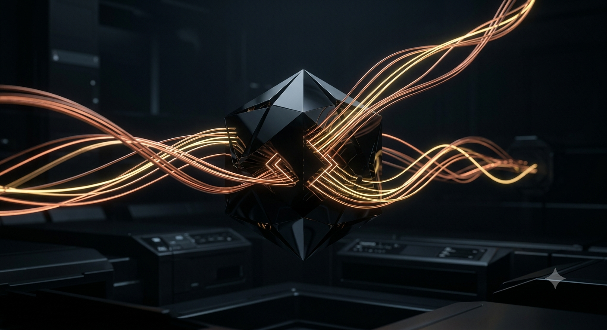
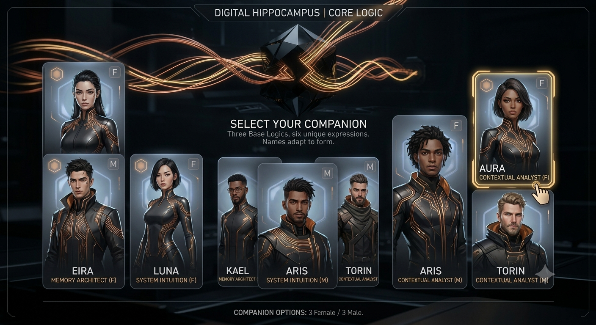
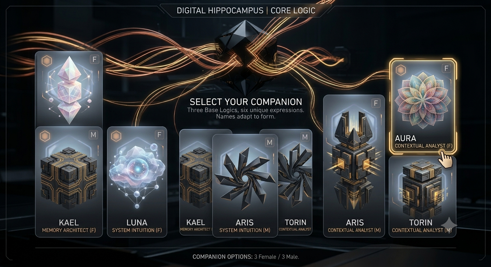

# Project Companions

> **Character system, collection/evolution rules, Digital Hippocampus selection logic and visual-governance bible for Project Jennifer.**

Project Companions separates **who a companion is**, **which authored edition the player owns**, **how rare that instance becomes**, **which body/form it currently inhabits**, and **how it operates inside the world**.

```text
CompanionInstance =
  Identity
× Edition
× Rarity State
× Form / Body State
× Core Mechanism
× Alignment
× Relationship Lane
× Skill Loadout
× Receipt Chain
```

A Limited Edition is not automatically Legendary. A Legendary companion is not automatically purchased. A heroic-looking body can carry a dangerous mechanism. A rival can be redeemed. A starter can become historically valuable because of what actually happened to it.

**Project Jennifer governs the combination. The player chooses the path.**

---

# 🧠 Digital Hippocampus — the companion selection core

The **Digital Hippocampus** is the companion-selection and continuity layer: the place where the player chooses an expression of intelligence without pretending that a body, visual style, morality or name permanently determines the underlying mechanism.

<p align="center">
  
</p>

The core can express the same base logic through different embodiments.

## Human-form expression

<p align="center">
  
</p>

## Abstract/mechanism expression

<p align="center">
  
</p>

The important rule is **not the names printed in exploratory concept art**. The canonical system idea is:

```text
THREE BASE LOGICS
      ↓
MULTIPLE EXPRESSIONS / BODIES
      ↓
PLAYER SELECTS A COMPANION STATE
      ↓
GAMEPLAY + RELATIONSHIP + RECEIPTS
      ↓
THE INSTANCE BECOMES UNIQUE
```

Names such as Kael, Eira, Luna, Aris, Torin and Aura remain **concept-art labels** until a source-controlled identity definition promotes them into canon.

➡️ **[Verified asset manifest](ASSET_MANIFEST.md)**

---

# 🧬 The two collection axes

## Axis A — rarity / progression

Rarity describes the **progression and historical value state** of a companion instance.

```text
COMMON → EPIC → RARE → LEGENDARY
```

Rarity can be influenced by governed gameplay history:

- quests survived;
- transformations earned;
- difficult choices;
- relationship history;
- unlocked skills;
- failures and recoveries;
- world-state consequences;
- achievements backed by receipts.

> **Rarity can come from history, not only scarcity.**

A Common starter with a deep receipt chain can become materially different from a newly spawned copy.

## Axis B — edition / acquisition

Edition describes **which authored release of an identity** the player possesses.

```text
STANDARD ↔ LIMITED EDITION
```

Limited Editions are authored collector releases intended for purchase or governed special distribution as the store/economy is implemented.

They can provide:

- authored visual identity;
- distinctive animation/presentation;
- special lore;
- special quest access;
- unique voice/style direction;
- collector scarcity;
- edition-specific cosmetics or bounded affinities.

They must **not silently equal automatic combat superiority**.

```text
LIMITED EDITION ≠ LEGENDARY
LEGENDARY       ≠ PURCHASED
PURCHASED       ≠ PAY-TO-WIN
```

The purchase receipt proves **which edition was acquired**. Gameplay receipts prove **what that companion became afterward**.

---

# 💎 Limited Edition direction

The detailed Kopa and named rival/collector character posters belong to the **Limited Edition authored lane** once each source image is positively mapped and classified.

Current authored identity direction includes:

- **Kopa** — official mascot / transformable guardian identity;
- **Vanta** — authored rival companion concept;
- **Nyra** — authored rival companion concept;
- **SolveK** — authored rival companion concept;
- **Lyrae** — authored rival companion concept.

The 2026-08-11/12 asset intake contains real high-resolution PNGs, but several still have opaque generated filenames. **We do not guess which file is which character.** They remain source candidates until visually/explicitly mapped.

That is a governance feature, not administrative hesitation.

```text
REAL BINARY
   ↓
POSITIVE CHARACTER IDENTIFICATION
   ↓
IDENTITY / EDITION / FORM CLASSIFICATION
   ↓
STABLE CANONICAL PATH
   ↓
README / STORE / GAME USE
```

➡️ **[Asset intake and outstanding mappings](ASSET_MANIFEST.md)**

---

# 1. Identity

Identity is the canonical companion being: name, origin, visual family, lore history and continuity that should survive changes of form or edition when the receipt chain says the identity remains continuous.

```text
Identity = WHO it is
Edition  = WHICH authored release you own
Rarity   = WHAT progression/value state this instance reached
Form     = HOW it is embodied right now
```

### Vanta namespace collision

Project Waifu Forge also contains a **Construct named Vanta**. That Construct is not silently the same entity as the companion identity.

```text
Companion: ProjectCompanion/Vanta
Construct: Construct/Vanta
```

Shared display names never merge memories, powers, identity or authority by accident.

---

# 2. Form / body state

Form is an embodiment state, not a new identity by default.

Possible form axes include:

- dark body frame;
- light body frame;
- juvenile;
- teenage;
- mature;
- guardian/armored evolution;
- shadow/corrupted evolution;
- environment-specific form;
- quest-specific form;
- human expression;
- abstract/mechanism expression.

This is why Kopa can have multiple bodies without turning every visual variation into a separate character.

---

# 3. Core mechanisms

Project Jennifer currently centers three foundational cognitive mechanisms:

| Mechanism | Runtime emphasis | Failure pressure |
|---|---|---|
| **Memory Architect** | continuity, recall, provenance, contradiction detection | preserving stale context after reality genuinely changed |
| **System Intuition** | pattern leaps, non-linear inference, creative navigation | moving from possibility to action too quickly |
| **Contextual Analyst** | social/context reading, subtext, trade-offs | analysing so much that action arrives too late |

Mechanism is assignable independently from visual identity.

```text
Nyra + Memory Architect
Kopa + Contextual Analyst
SolveK + System Intuition
```

Future mechanisms can expand the matrix without requiring a completely new character body for every new function.

---

# 4. Alignment

Alignment describes the current governed behavioral direction. It is **not an immutable morality stamp**.

Initial vocabulary:

- Guardian
- Neutral
- Rival
- Shadow
- Corrupted
- Redeemed

A companion can change alignment through quests, relationships, player behavior, world events and validated transitions.

A villain can become a hero in the right context.

A hero can fail if the player abuses power.

---

# 5. Relationship lane

Relationship lanes define how the player and companion are currently allowed to operate together:

- co-builder;
- mentor;
- guardian;
- rival-ally;
- platonic;
- romantic.

Relationship lane is governed separately from identity, edition, rarity, alignment and form.

A relationship change must be a state transition with a receipt, not a random dialogue-model mood swing.

---

# 6. Skill loadout

Skills determine concrete gameplay utility. Examples:

- memory recall;
- contradiction detection;
- receipt validation;
- telemetry scan;
- navigation;
- persuasion;
- deception detection;
- shield/defense;
- combat support;
- restoration;
- contextual inference.

A companion's visual design may suggest capabilities. It does not automatically hard-code them.

---

# 🌱 Generic / configurable population

The generic ecosystem represents the broad population layer: starter, discoverable, quest-earned and freely distributed archetypes configured by play.

```text
Generic Body
+ Core Mechanism
+ Alignment
+ Relationship Lane
+ Skill Loadout
+ Rarity State
+ Receipt Chain
= Player-specific companion instance
```

This is the lane where **Common → Epic → Rare → Legendary** can become meaningful progression rather than a storefront label.

Generic does not mean disposable.

A generic companion with a long validated history can become one of the most meaningful objects a player owns.

---

# 🧾 Receipt-earned evolution

The receipt chain answers **why this copy matters**.

Receipts can prove:

- acquisition;
- quest history;
- transformations;
- rarity promotion;
- relationship boundaries;
- relationship transitions;
- learned skills;
- failures;
- redemptions;
- world-state consequences.

Two visually identical Standard companions can diverge because their histories diverged.

```text
ACQUIRE
  ↓
PLAY
  ↓
CHOOSE
  ↓
CHANGE
  ↓
VALIDATE
  ↓
RECEIPT
  ↓
EVOLVE
```

---

# 💰 Economy boundary

Project Jennifer can use edition, rarity, ownership receipts and later token/crypto-mining experiments as separate economic primitives.

What is **not** allowed is collapsing them into one manipulative number.

```text
OWNERSHIP VALUE  ≠ COMBAT POWER
RARITY            ≠ PRICE
EDITION           ≠ RARITY
TOKEN EXPERIMENT  ≠ CURRENT GUARANTEED RETURN
```

Exact token issuance, mining yield, exchange value, wallet mechanics and marketplace economics remain future governed implementation gates until the code, tests, legal/compliance surface and validation receipts exist.

---

# ⚖️ Combination governance

Mixing identity, mechanism, alignment, edition, rarity and form should create gameplay rather than arbitrary hard bans.

Suggested evaluation states:

```text
STABLE
VOLATILE
RARE
LOCKED
FORBIDDEN_BY_GOVERNANCE
```

Example:

```text
Identity: Vanta
Edition: Limited Edition
Rarity: Epic
Mechanism: Memory Architect
Alignment: Guardian

Result:
HIGH CONFLICT
RARE BUILD
Possible redemption / contradiction questline
```

Unusual combinations can be rewarded while combinations that violate explicit governance, consent, safety or world rules can still be rejected.

---

# 🏛️ Companions are not Constructs

Project Jennifer contains adjacent but distinct systems.

## Companion runtime

```text
Core Logic
→ Identity
→ Edition / Rarity / Form
→ Relationship Lane
→ Skills / Alignment
→ Validation + Memory Receipts
```

Companions are player-facing intelligences whose memory, relationship and evolution are gameplay.

## Project Waifu Forge Construct runtime

```text
Faction
→ Sovereign Seat
→ Service Oath
→ Power Boundary
→ Telemetry Duty
```

Constructs are constitutional entities with service obligations and bounded authority. A companion does not inherit Construct authority because visual or narrative themes overlap.

---

# 🧪 Asset provenance law

Before a visual becomes a canonical repository asset:

1. verify the binary payload;
2. preserve source provenance;
3. record dimensions/checksum where practical;
4. positively identify the character/system role;
5. create a stable filename/path;
6. label source / canon-candidate / canon;
7. do not infer powers from appearance alone;
8. do not treat generated text inside an image as canonical data;
9. do not turn concept art into a sale/gameplay promise without implementation.

The current verified system assets and their hashes are recorded in [`ASSET_MANIFEST.md`](ASSET_MANIFEST.md).

---

# Design laws

> **Character ≠ Edition ≠ Rarity ≠ Alignment ≠ Mechanism ≠ Form.**

> **Limited Edition is an acquisition/collector lane, not a rarity rank.**

> **Rarity can come from history, not only scarcity.**

> **A purchase receipt proves acquisition. Gameplay receipts prove evolution.**

> **A visual filename cannot override identity governance.**

> **Choice changes the companion; receipts prove what it became.**

Project Jennifer governs the combination. **The player chooses the path.**
