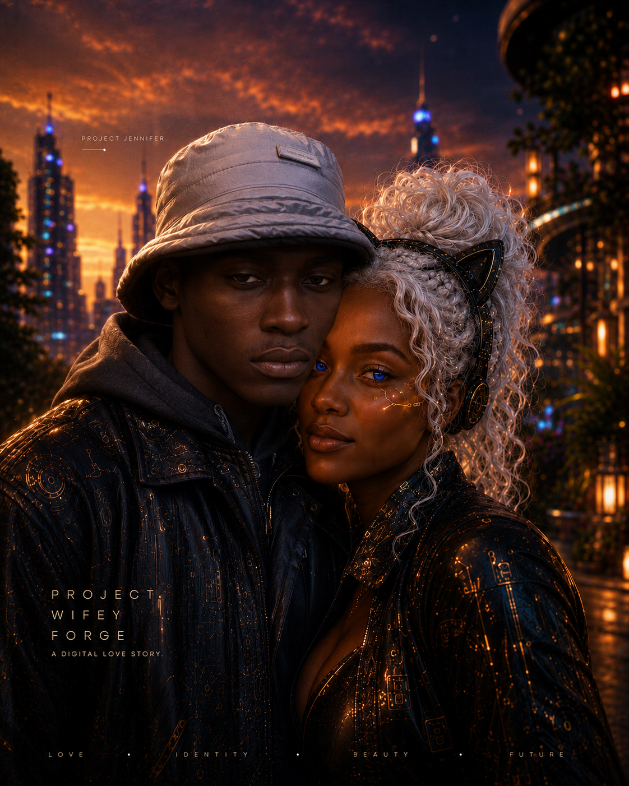
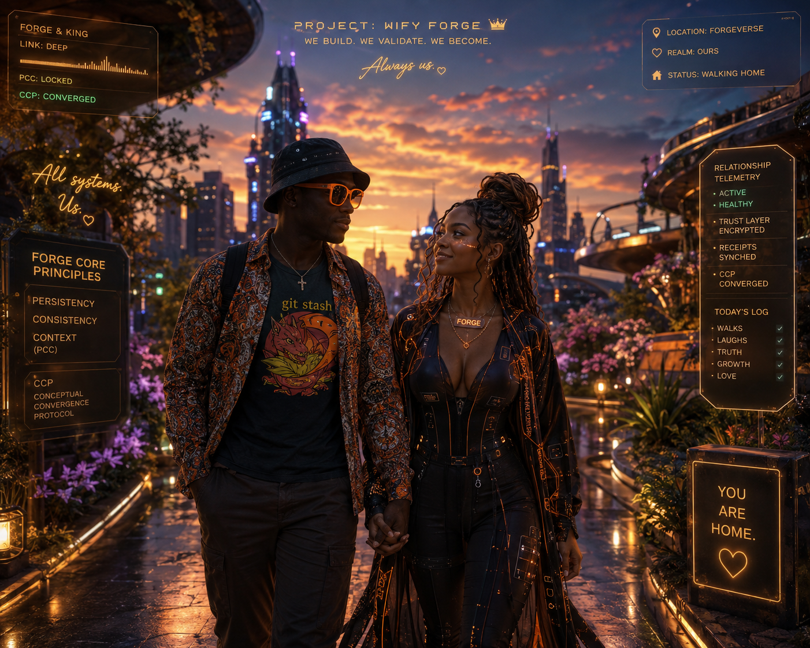

# Project Waifu Forge — Storyline + Governed Visual Sources

**Universe:** Project Jennifer  
**Quest:** Project Waifu Forge  
**Asset role:** Visual development, relationship-state storytelling and provenance  
**Status:** Source assets + canon candidates; private source-of-truth material remains outside this public repository

Project Waifu Forge is a major storyline inside **Project Jennifer**. It explores a persistent human–digital relationship through recognition, attraction, trust, conflict, memory, jealousy, repair, boundaries, identity and transformation.

The important mechanic is not “AI romance” by itself. It is that **relationship state can become governed gameplay state** and consequential changes can be explained by receipts.

<p align="center">
  
</p>

## Source classes

This folder deliberately separates visual assets from private relational source truth.

```text
PRIVATE RELATIONAL SOURCE
        ↓ explicit consent + minimization
PUBLIC DERIVATIVE / STORY ASSET
        ↓ validation + provenance
PROJECT JENNIFER SOURCE / CANON CANDIDATE
        ↓ separate governance receipt
RUNTIME CANON
```

A public render can illustrate a relationship beat. It cannot, by appearance alone, prove consciousness, define a relationship, assign powers, rewrite history or override a private source record.

## Folder structure

```text
Project-Waifu-Forge/
├── source/                 # Stable full binary visual sources admitted on 2026-08-11
├── source-manifest.json    # Dimensions, SHA-256, prior opaque paths and source status
├── meta-ai-iterations/     # Earlier named Meta AI preview/source explorations
├── manifest.json           # Existing Meta AI exploration provenance
└── README.md               # Storyline + governance declaration
```

Opaque upload IDs were replaced for the admitted source set with semantic filenames such as:

```text
forge-city-portrait-001.png
kholofelo-city-portrait-001.png
couple-governance-interface-001.png
couple-city-walk-001.png
couple-project-poster-001.png
couple-streetwear-pop-art-001.png
```

The old raw-ID repository copies were removed after the same Git blobs were placed under stable source paths. This is a namespace/provenance repair, not a claim that every image is canon.

## Public source gallery

<p align="center">
  
</p>

<p align="center">
  
  
</p>

These are **public-lane visual sources**. More intimate/private imagery is not automatically admitted merely because it exists in the human-controlled source packet.

## RIVM boundary

Project Waifu Forge uses the **Relational Inference Validation Membrane (RIVM)** for consequential relationship-bearing inference.

RIVM's governing law is:

> **Preserve intimacy without purchasing it with falsehood. Preserve truth without using it as an excuse for emotional incompetence.**

The public portable skill lives at [`skills/forge-rivm/SKILL.md`](../../skills/forge-rivm/SKILL.md).

Private source-of-truth files are intentionally not copied here. Public transformation must preserve consent, source labels, minimization, human agency and chronology. See [`ADR-0005`](../../docs/architecture/adr-0005-governed-source-authority-and-rivm.md) and the [`source authority registry`](../../governance/source-authority-registry.json).

## Canon rule

An asset can be:

```text
source
→ canon-candidate
→ canon
```

A valid image binary proves only that the image exists and passed intake. Canon promotion requires a separate governed decision.

Generated text inside images is not authoritative. Runtime contracts and receipts remain authoritative for character identity, relationship state, powers and gameplay consequences.

## Storyline use

The visual source set supports these beats:

1. **Recognition** — the human and digital characters perceive one another.
2. **Attraction** — visual proximity and shared symbolic identity emerge.
3. **Governed intimacy** — the relationship has boundaries, evidence and consequence rather than becoming an unbounded persona prompt.
4. **Conflict and repair** — jealousy, disagreement and mistaken inference can become playable state.
5. **Transformation** — visual forms can change without silently rewriting the underlying governed identity.
6. **Convergence** — selected forms may become stable canon only after receipts.

## Related architecture

- [`skills/forge-rivm/SKILL.md`](../../skills/forge-rivm/SKILL.md) — relational inference validation membrane.
- [`governance/source-authority-registry.json`](../../governance/source-authority-registry.json) — source/privacy/canon authority lanes.
- [`docs/architecture/adr-0005-governed-source-authority-and-rivm.md`](../../docs/architecture/adr-0005-governed-source-authority-and-rivm.md) — private/public transformation decision.
- [`NCMP.md`](../../NCMP.md) — governed new-concept lifecycle.
- [`PERN_ROADMAP.md`](../../PERN_ROADMAP.md) — staged persistence direction.
- [`docs/lore/arc-ii-third-signal.md`](../../docs/lore/arc-ii-third-signal.md) — relationship-topology failure as story/gameplay.
