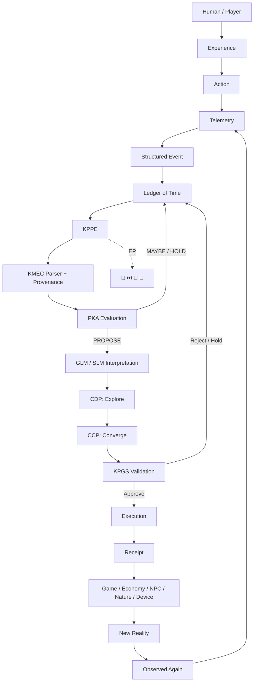

# KPPE Lightweight Diagram



## ASCII fallback

```text
PLAYER
  ↓
EXPERIENCE → ACTION → TELEMETRY → STRUCTURED EVENT
                                  ↓
                            LEDGER OF TIME
                                  ↓
                                 KPPE
                                  ↓
                   KMEC PARSE + PROVENANCE
                                  ↓
                           PKA EVALUATION
                           ↙             ↘
                    MAYBE/HOLD          PROPOSE
                        ↓                  ↓
                     LEDGER      GLM / SLM INTERPRET
                                           ↓
                                          CDP
                                           ↓
                                          CCP
                                           ↓
                                     KPGS VALIDATE
                                      ↙          ↘
                                  HOLD          APPROVE
                                    ↓              ↓
                                 LEDGER         EXECUTE
                                                   ↓
                                                RECEIPT
                                                   ↓
                      GAME / ECONOMY / NPC / NATURE / DEVICE
                                                   ↓
                                             NEW REALITY
                                                   ↓
                                            OBSERVED AGAIN
                                                   ↺
```
