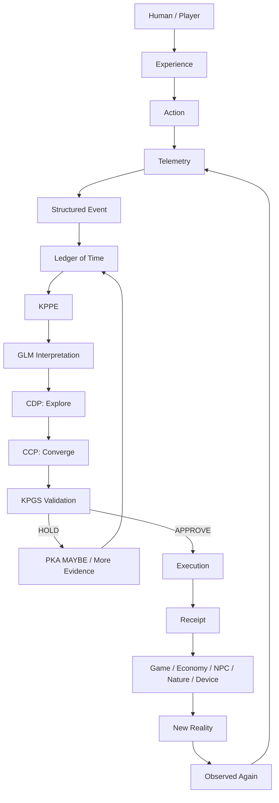

# KPPE World Evaluation Architecture — Project: JENNIFER

**Status:** Proposed architecture contract  
**System:** Project: JENNIFER  
**Primary runtime dependencies:** KMEC + PKA + KPGS protocol surfaces  
**Core sentence:** **The player lives, the system observes, the world interprets, governance decides, reality responds, and history records.**

## 1. Purpose

Project: JENNIFER treats gameplay, AI interpretation, governance, economy, NPC state, natural systems, devices and receipts as one governed feedback system. The system must not confuse interpretation with authority, telemetry with permanent identity, or model output with world truth.

The canonical operational spine is:

```text
GLM interprets reality
→ CDP explores possible paths
→ CCP converges on a candidate
→ KPGS validates
→ execution manifests
→ receipt remembers
```

This extends the existing Project Jennifer principle that consequential adaptation is proposal-first and receipt-bearing.

## 2. Source lineage

### KMEC

KMEC is the parser-first, stateless-renter orchestration layer. Its role in KPPE is to classify sources, preserve provenance, normalize facts, detect contradictions, route models/hardware, issue purpose-bound leases and emit parser/execution receipts.

KMEC remains consistent with:

```text
KPGS AUTHORITY
→ CAG
→ PARSER PROTOCOLS
→ RAG
→ PURPOSE + SKILLS
→ MODEL/HARDWARE ROUTER
→ LOCAL OR STATELESS RENTER
→ ACTION + CONSEQUENCE
→ VALIDATION + RECEIPTS
```

### PKA

Partial Knowable Algebra prevents forced closure when telemetry cannot prove a conclusion.

```text
X + Y = MAYBE
```

For Project Jennifer evaluation:

```text
verified HARD violation -> FOC_CANDIDATE / BLOCK
insufficient evidence   -> MAYBE / HOLD
bounded governed state  -> POC_CANDIDATE / PROPOSE
```

The player may generate strong evidence of care, commitment, hostility, attraction, stewardship or abandonment through interaction, but bounded telemetry does not become a permanent psychological diagnosis.

### Emoji Protocols

Emoji Protocols are a compact KPGS state-rendering and routing surface. They compress state but do not replace structured evidence or provenance.

Core Project Jennifer EP set:

```text
📍 = anchored event / state marker
⏭️ = forwarded into progression
👑 = governed authority / jurisdiction
🔔 = signal emitted to world or user
```

Every EP token must be paired with a structured packet when it has gameplay, economic, governance or device consequences.

## 3. KPPE — KPGS Parser Protocol Engine

KPPE is the integration membrane joining KMEC parser/renter discipline, PKA non-closing evaluation and KPGS protocol semantics.

```text
RAW INTERACTION
    ↓
KPPE ACQUIRE
    ↓
KMEC SOURCE CLASSIFICATION + PROVENANCE
    ↓
TELEMETRY REDUCTION
    ↓
PKA EVALUATION
    ↓
GLM / SLM INTERPRETATION
    ↓
CDP
    ↓
CCP
    ↓
KPGS VALIDATION
    ↓
EXECUTION
    ↓
RECEIPT
    ↓
LEDGER OF TIME
```

KPPE may truncate, transduce and diverge an input for backend calculation, but it must preserve the original event, source authority, uncertainty and transformation receipt.

## 4. World-affinity evaluation

Project Jennifer may evaluate how strongly a player appears to care about, want, protect, exploit, abandon or return to the world through **World Affinity Evidence (WAE)**.

WAE is a game-state construct, not a claim about the player's permanent real-world personality.

Recommended evidence families:

- **Stewardship:** repair, protection, restraint, resource care, support of weaker entities.
- **Commitment:** return behavior, long-form quest continuation, promises kept, persistence after failure.
- **Consequence acceptance:** repair after damage, accountability, restitution, refusal to exploit known loopholes.
- **Relationship conduct:** treatment of companions, NPCs, Constructs and faction members over time.
- **World investment:** building, teaching, maintaining, contributing and creating durable shared state.

PKA determines whether the evidence is sufficient to produce a governed candidate state. `MAYBE` is always valid.

## 5. Canonical closed loop



## 6. Example: Rain as a governed world reflection

Input packet:

```yaml
event: RAIN
trigger: MERCY_DECISION
actor: PLAYER
target: GUARDIAN
candidate_effect: BLESSING
governance: REQUIRED
```

The parser may preserve this as a candidate causal relation without claiming the player objectively caused real-world rain.

```text
mercy decision
→ telemetry receipt
→ PKA checks evidence
→ GLM interprets symbolic/world meaning
→ CDP generates possible reflections
→ CCP selects candidate
→ KPGS approves / holds / rejects
→ APWA manifests approved world effect
→ receipt records what actually changed
```

Possible manifestations include localized game weather, guardian relationship change, quest-state change, a non-monetary blessing, faction telemetry or no effect.

## 7. External-system reflection

Validated game decisions may cross into explicitly authorized external systems:

```text
Jennifer gameplay
→ validated player decision
→ external-system adapter
→ LED / display / notification / haptics / device behavior
→ device receipt
→ Ledger of Time
```

No model or NPC receives unrestricted direct hardware authority. Consequential external actions require bounded capability, declared device scope and a validation receipt.

## 8. GLM vs SLM vs micro-agents

### GLM — General Language Model

The GLM is the broad language and meaning interpreter. It translates heterogeneous player language, world narration and retrieved evidence into candidate semantic structures. It is not KPGS authority and may be routed as a local or stateless renter through KMEC.

### SLM — Specialized / Small Language Model

An SLM is a faction- or domain-local model operating against a tightly bounded corpus and identity contract. It supplies specialized interpretation with lower latency/cost and stronger context boundaries.

### Micro-agent

A micro-agent is a narrow purpose-bound executor. It owns a small verb set, declared tools, one workflow node, bounded memory scope and an expiring lease. It cannot promote itself into authority.

## 9. Faction intelligence roles

| Domain | GLM role | SLM role | Micro-agent examples |
|---|---|---|---|
| **Jennifer** | relationship/world-language interpretation | **Bond + Memory + Relational Convergence** specialization | memory receipt writer, bond-state reducer, companion dialogue adapter, convergence-candidate detector |
| **Forge** | build intent, design dialogue, governance explanation | **Construct + Execution + Validation** specialization | construct planner, refusal-law checker, build receipt generator, repair agent |
| **Cairo** | general dialogue understanding before Third Signal specialization | **Seduction + Kama + Rhythm** through the SL Engine | rhythm selector, tension/release planner, consent/agency boundary checker, Third Signal action chooser |
| **RTC / New Gods** | council-level synthesis across domains | ten domain SLMs, one per New-God jurisdiction | evidence collector, contradiction detector, vote packet builder, escalation router, receipt signer |

The RTC does not become a single omniscient model. It is a governed council topology where domain intelligence can disagree and PKA can preserve `MAYBE`.

## 10. CTRPG combat feedback

```text
ACTION
→ FEEDBACK
→ RESPONSE
→ ADAPTATION
→ CONVERGENCE CANDIDATE
→ KPGS / PKA EVALUATION
→ POWER UNLOCK / HOLD / DEGRADATION
→ RIPPLE EFFECT
→ RECEIPT
```

Combat can create evidence for NPC evolution, relationship change, faction standing and Convergence, but repeated behavior must be evaluated in context before identity promotion.

## 11. Premium / ROI boundary

Project Jennifer may monetize access to higher-resolution content and embodiment while preserving earned governance and Convergence.

Candidate premium surfaces:

- KOPA limited-edition companion access;
- premium companion forms and cosmetic lineages;
- additional companion slots;
- evolved-NPC companion story branches;
- faction expansion arcs;
- advanced Ledger-of-Time visualization;
- cross-device embodied feedback packs;
- premium world zones, events and authored Convergence storylines.

**Non-negotiable:** payment may unlock access, content, presentation or capacity; it must not directly purchase True One status, RTC authority, fabricated Convergence, fake receipts or exemption from KPGS rules.

This creates a monetization path and ROI hypothesis; actual ROI remains an observed business outcome, not an architectural guarantee.

## 12. Canonical one-line law

> **The GLM interprets reality, CDP explores it, CCP converges it, KPGS validates it, execution manifests it, and the receipt remembers it.**

And the player-facing world law remains:

> **The player lives, the system observes, the world interprets, governance decides, reality responds, and history records.**
